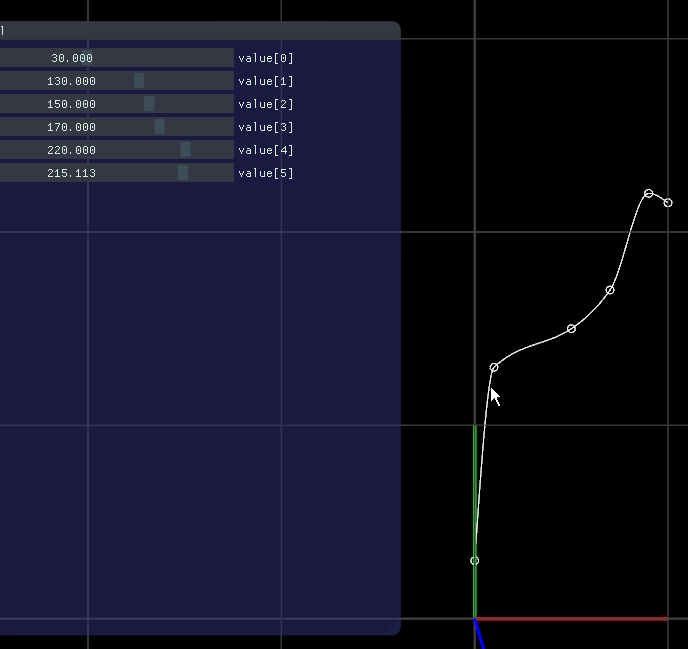

## Constrained Cubic Spline Interpolation
naive implementation of
CJC Kruger, "Constrained Cubic Spline Interpolation for Chemical Engineering Applications"
http://www.korf.co.uk/spline.pdf

with openframeworks (but no dependency )

## example

```
ConstrainedCubicSplineInterpolation<float> func({
	{ 0, 30 },{ 10, 130 },{ 50, 150 },{ 70, 170 },{ 90, 220 },{ 100, 320 },
});
func.evaluate(x);
```

## Demo
